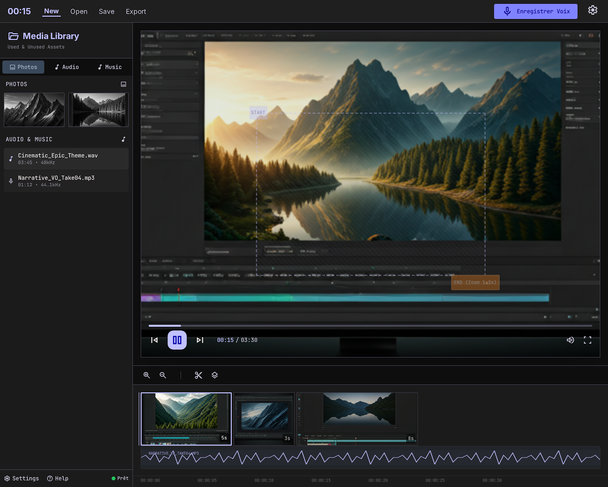

<div align="center">

# 🎬 Vidéor

### Le montage photo et audio, simplement.

Une application de bureau Linux pour créer une vidéo à partir de photos et
d'une piste audio, sans la complexité d'un logiciel de montage professionnel.

[](#-prérequis)
[](https://www.electronjs.org/)
[](https://react.dev/)
[](https://www.typescriptlang.org/)
[](https://ffmpeg.org/)

</div>

<p align="center">
  
</p>



> [!NOTE]
> Vidéor est actuellement en phase MVP. L'application cible exclusivement les
> ordinateurs Linux.

## 📑 Sommaire

- [Pourquoi Vidéor ?](#-pourquoi-vidéor-)
- [Fonctionnalités](#-fonctionnalités)
- [Prérequis](#-prérequis)
- [Installation](#-installation)
- [Utilisation](#-utilisation)
- [Créer un paquet Linux](#-créer-un-paquet-linux)
- [Architecture](#-architecture)
- [Format des projets](#-format-des-projets)
- [Feuille de route](#-feuille-de-route)
- [Suivi du projet](#-suivi-du-projet)

## 💡 Pourquoi Vidéor ?

Les logiciels comme Kdenlive sont puissants, mais leur richesse peut rendre un
montage simple inutilement difficile. Vidéor se concentre sur un scénario clair :

1. **Importer des photos**
2. **Choisir leur ordre et leur durée**
3. **Ajouter une piste audio**
4. **Prévisualiser le résultat**
5. **Exporter la vidéo**

## ✨ Fonctionnalités

| Domaine | Fonctionnalités |
| --- | --- |
| 📁 **Projet** | Nouveau projet, ouverture, import, export et sauvegarde automatique |
| 🖼️ **Photos** | Import multiple, glisser-déposer, réorganisation et suppression |
| 🎞️ **Vidéo** | Import d'une vidéo, coupe du début, de la fin ou d'une plage interne |
| ✂️ **Édition** | Durée, rotation, recadrage simple et positionnement |
| 🎵 **Audio** | Import ou remplacement, lecture synchronisée et réglage du volume |
| 📊 **Timeline** | Une vignette par photo, durée visuelle et forme d'onde audio |
| ▶️ **Aperçu** | Lecture, pause, navigation temporelle et mode plein écran |
| 📦 **Export** | MP4/H.264 ou WebM/VP9 en 720p, 1080p ou 4K |

## 🧰 Prérequis

| Outil | Version recommandée | Vérification |
| --- | --- | --- |
| 🐧 Linux | Distribution récente | `uname -a` |
| 🟢 Node.js | 20 ou plus récent | `node --version` |
| 📦 npm | Fourni avec Node.js | `npm --version` |
| 🎞️ FFmpeg | Avec H.264 et VP9 | `ffmpeg -version` |
| 🔍 FFprobe | Fourni avec FFmpeg | `ffprobe -version` |

Sur Debian ou Ubuntu :

```bash
sudo apt update
sudo apt install ffmpeg
```

## 🚀 Installation

Clonez le dépôt, puis installez les dépendances :

```bash
git clone https://github.com/nouhailler/videor2.git
cd videor2
npm install
```

Lancez l'application en mode développement :

```bash
npm run dev
```

> [!TIP]
> Les messages `libva error` liés à un GPU virtuel ne sont généralement pas
> bloquants. Electron bascule automatiquement vers un rendu logiciel.

## 🎛️ Utilisation

### Mode développement

```bash
npm run dev
```

Vite démarre l'interface sur `http://127.0.0.1:5173`, puis Electron ouvre la
fenêtre de l'application.

### Build local

```bash
npm run build
npm start
```

### Commandes disponibles

| Commande | Description |
| --- | --- |
| `npm run dev` | Lance Vite et Electron avec rechargement à chaud |
| `npm run build` | Vérifie TypeScript et génère le build de production |
| `npm start` | Lance Electron avec le build présent dans `dist/` |
| `npm test` | Exécute les tests Vitest |
| `npm run package:linux` | Produit les paquets AppImage et DEB |

## 📦 Créer un paquet Linux

```bash
npm run package:linux
```

Les paquets sont générés dans le dossier `release/` :

```text
release/
├── Videor-0.2.0-x64.AppImage
└── Videor-0.2.0-amd64.deb
```

## 🏗️ Architecture

```text
videor/
├── electron/
│   ├── main.cjs          # Fenêtre, fichiers projet et export FFmpeg
│   └── preload.cjs       # API sécurisée exposée à l'interface
├── src/
│   ├── App.tsx           # Éditeur et logique de l'interface
│   ├── main.tsx          # Point d'entrée React
│   ├── styles.css        # Design system et mise en page
│   └── videor.d.ts       # Types de l'API Electron
├── stitch/               # Prototype et références de conception
├── package.json
└── vite.config.ts
```

### Technologies

- ⚛️ **React** pour l'interface
- 🔷 **TypeScript** pour le typage
- ⚡ **Vite** pour le développement et le build
- 🖥️ **Electron** pour l'intégration Linux
- 🎞️ **FFmpeg** pour l'encodage MP4 et WebM
- 🧩 **Lucide** pour les icônes de l'interface

## 💾 Format des projets

Les projets utilisent l'extension `.videor`. Il s'agit d'un document JSON
contenant notamment :

- les chemins des photos et de la piste audio ;
- le chemin de la vidéo source et ses repères de coupe ;
- l'ordre et la durée de chaque photo ;
- la rotation et les paramètres de recadrage ;
- le volume de la piste audio.

> [!WARNING]
> Le fichier projet référence actuellement les médias à leur emplacement
> d'origine. Déplacer ou supprimer ces fichiers peut empêcher leur chargement.

## 🗺️ Feuille de route

- [x] Interface principale et timeline simplifiée
- [x] Import multiple et glisser-déposer
- [x] Lecture synchronisée avec l'audio
- [x] Sauvegarde automatique des projets
- [x] Export MP4/H.264 et WebM/VP9
- [x] Découpe non destructive d'une vidéo existante
- [ ] Transitions entre les photos
- [ ] Effet de mouvement Ken Burns
- [ ] Enregistrement d'une narration
- [ ] Projet portable avec médias embarqués
- [x] Premiers tests unitaires des calculs de découpe
- [ ] Tests automatisés de l'interface et de l'export

## 📝 Suivi du projet

- Consultez [`CHANGELOG.md`](CHANGELOG.md) pour les changements entre versions.
- Consultez [`CONTEXT.md`](CONTEXT.md) pour reprendre rapidement le
  développement et connaître les limites actuelles.

---

<div align="center">

**Vidéor** · Un éditeur vidéo volontairement simple pour Linux.

</div>
